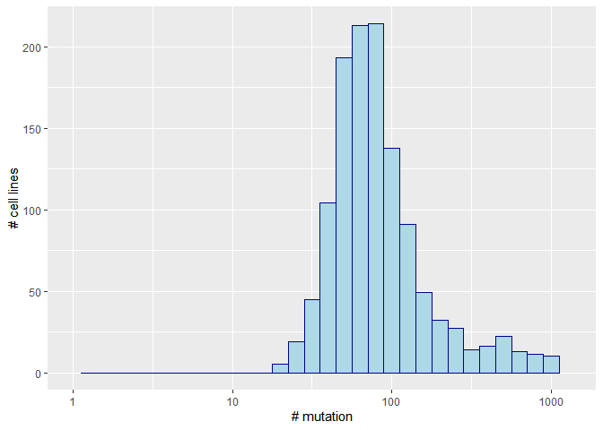

# 1.Preparation 
## 1.1 Enviroment setup

```r
requiredPackages = c('here','ggplot2','compare')
for(p in requiredPackages){
  if(!require(p,character.only = TRUE)) install.packages(p)
  library(p,character.only = TRUE)
}
```

```
## Loading required package: here
```

```
## here() starts at E:/rstudio/drugcell_related
```

```
## Loading required package: ggplot2
```

```
## Loading required package: compare
```

```
## 
## Attaching package: 'compare'
```

```
## The following object is masked from 'package:base':
## 
##     isTRUE
```


## 1.2 Load drug infomation


```r
compoundname=read.csv2(here("data","compound_names.txt"),header=TRUE,sep="\t")
# CN1C=NC2=C1C=C(C(=C2F)NC3=C(C=C(C=C3)Br)Cl)C(=O)NOCCO
drugcell_all=read.csv2(here("data","drugcell_all.txt"),header=FALSE,sep="\t")

# table(grepl("CN1C=NC2=C1C=C(C(=C2F)NC3=C(C=C(C=C3)Br)Cl)C(=O)NOCCO",drugcell_all[,2],fixed=TRUE))
```

# 2. Plot distribution of mutations per cell line as Fig S1E
## plot Fig S1E, Histogram of the number of mutations per cell line used for model training, matched figure S1E

```r
cellname=read.csv2(here("data","cell2ind.txt"),header=FALSE,sep="\t")
cellmutation=read.csv2(here("data","cell2mutation.txt"),header=FALSE,sep=",")
genename=read.csv2(here("data","gene2ind.txt"),header=FALSE,sep="\t")
distribution_cellmutation=as.data.frame(apply(cellmutation,1,FUN=sum))
distribution_drugmutation=as.data.frame(apply(cellmutation,2,FUN=sum))


distribution_cellmutation1=as.data.frame(t(rbind(c(1:length(distribution_cellmutation[,1])),(distribution_cellmutation[,1]))))

ggplot(data.frame(distribution_cellmutation1), aes(x=V2))+xlab("# mutation")+ylab("# cell lines")+ scale_x_continuous(limits=c(1,1335),trans='log10')+
  geom_histogram(color="darkblue", fill="lightblue",binwidth=0.1
  )
```

```
## Warning: Transformation introduced infinite values in continuous x-axis
```

```
## Warning: Removed 4 rows containing non-finite values (stat_bin).
```

```
## Warning: Removed 2 rows containing missing values (geom_bar).
```

<!-- -->

# 3. Check number of cell lines tested with specific drugs

## 3.1 Paclitaxel: total 997 pairs for Paclitaxel, 2 different structures, which have 239, 758 cell lines respectively, 239 is same as Fig 3F's number

```r
compoundname[which(grepl("Paclitaxel",compoundname[,3],ignore.case = TRUE)),]
```

```
##     number
## 265    264
## 359    358
##                                                                                                                                                                             SMILE
## 265 CC1=C2[C@H](C(=O)[C@@]3([C@H](C[C@@H]4[C@]([C@H]3[C@@H]([C@@](C2(C)C)(C[C@@H]1OC(=O)[C@@H]([C@H](C5=CC=CC=C5)NC(=O)C6=CC=CC=C6)O)O)OC(=O)C7=CC=CC=C7)(CO4)OC(=O)C)O)C)OC(=O)C
## 359     CC1=C2[C@H](C(=O)[C@@]3([C@H](C[C@@H]4[C@](C3[C@@H]([C@@](C2(C)C)(C[C@@H]1OC(=O)[C@@H]([C@H](C5=CC=CC=C5)NC(=O)C6=CC=CC=C6)O)O)OC(=O)C7=CC=CC=C7)(CO4)OC(=O)C)O)C)OC(=O)C
##                                                                                                                                                                                         Name
## 265 paclitaxel;CC1=C2[C@H](C(=O)[C@@]3([C@H](C[C@@H]4[C@]([C@H]3[C@@H]([C@@](C2(C)C)(C[C@@H]1OC(=O)[C@@H]([C@H](C5=CC=CC=C5)NC(=O)C6=CC=CC=C6)O)O)OC(=O)C7=CC=CC=C7)(CO4)OC(=O)C)O)C)OC(=O)C
## 359                                                                                                                                                                               paclitaxel
```

```r
# first pacilitaxel row 265, has 239 pairs/cell lines which match the number of Figure 3F
drugcell_pacilitaxel1=drugcell_all[drugcell_all[,2]=="CC1=C2[C@H](C(=O)[C@@]3([C@H](C[C@@H]4[C@]([C@H]3[C@@H]([C@@](C2(C)C)(C[C@@H]1OC(=O)[C@@H]([C@H](C5=CC=CC=C5)NC(=O)C6=CC=CC=C6)O)O)OC(=O)C7=CC=CC=C7)(CO4)OC(=O)C)O)C)OC(=O)C",]
length(table(drugcell_pacilitaxel1[,1]))
```

```
## [1] 239
```

```r
# second pacilitaxel row 359, has 758 pairs/cell liens, I don't know what it is

drugcell_pacilitaxel2=drugcell_all[drugcell_all[,2]=="CC1=C2[C@H](C(=O)[C@@]3([C@H](C[C@@H]4[C@](C3[C@@H]([C@@](C2(C)C)(C[C@@H]1OC(=O)[C@@H]([C@H](C5=CC=CC=C5)NC(=O)C6=CC=CC=C6)O)O)OC(=O)C7=CC=CC=C7)(CO4)OC(=O)C)O)C)OC(=O)C",]
length(table(drugcell_pacilitaxel2[,1]))
```

```
## [1] 758
```


## 3.2 selumetinib: One mono test, and several combinations for selumetinib, 769 cell lines doesn't match Figure 3B's n=382

```r
# 8948 of combinations involved selumetinib
table(grepl("CN1C=NC2=C1C=C(C(=C2F)NC3=C(C=C(C=C3)Br)Cl)C(=O)NOCCO",drugcell_all[,2],fixed=TRUE))
```

```
## 
##  FALSE   TRUE 
## 500346   8948
```

```r
compoundname[which(grepl("selumetinib",compoundname[,3],ignore.case = TRUE)),]
```

```
##     number
## 89      88
## 148    147
## 354    353
## 355    354
## 382    381
## 391    390
## 527    526
## 566    565
## 578    577
## 590    589
## 605    604
## 626    625
##                                                                                                                                                                                            SMILE
## 89                                                                   CN1C=NC2=C1C=C(C(=C2F)NC3=C(C=C(C=C3)Br)Cl)C(=O)NOCCO.CS(=O)(=O)N1CCN(CC1)CC2=CC3=C(S2)C(=NC(=N3)C4=C5C=NNC5=CC=C4)N6CCOCC6
## 148                                                                         CC(C)N1CCC(CC1)NC2=NC(=NC3=CC(=C(C=C32)OC)OCCCN4CCCC4)C5CCCCC5.CN1C=NC2=C1C=C(C(=C2F)NC3=C(C=C(C=C3)Br)Cl)C(=O)NOCCO
## 354                                                                      CN1C=NC2=C1C=C(C(=C2F)NC3=C(C=C(C=C3)Br)Cl)C(=O)NOCCO.C1CC(C1)(C2=CC=C(C=C2)C3=C(C=C4C(=N3)C=CN5C4=NNC5=O)C6=CC=CC=C6)N
## 355                                                                                                                                        CN1C=NC2=C1C=C(C(=C2F)NC3=C(C=C(C=C3)Br)Cl)C(=O)NOCCO
## 382                                                                CCCS(=O)(=O)NC1=C(C(=C(C=C1)F)C(=O)C2=CNC3=NC=C(C=C23)C4=CC=C(C=C4)Cl)F.CN1C=NC2=C1C=C(C(=C2F)NC3=C(C=C(C=C3)Br)Cl)C(=O)NOCCO
## 391 CC1(CCC(=C(C1)CN2CCN(CC2)C3=CC=C(C=C3)C(=O)NS(=O)(=O)C4=CC(=C(C=C4)N[C@H](CCN5CCOCC5)CSC6=CC=CC=C6)S(=O)(=O)C(F)(F)F)C7=CC=C(C=C7)Cl)C.CN1C=NC2=C1C=C(C(=C2F)NC3=C(C=C(C=C3)Br)Cl)C(=O)NOCCO
## 527                                                                                          CC1=C(C(CCC1)(C)C)/C=C/C(=C/C=C/C(=C/CO)/C)/C.CN1C=NC2=C1C=C(C(=C2F)NC3=C(C=C(C=C3)Br)Cl)C(=O)NOCCO
## 566                                                                  CC1=C(SC2=C1C(=N[C@H](C3=NN=C(N32)C)CC(=O)OC(C)(C)C)C4=CC=C(C=C4)Cl)C.CN1C=NC2=C1C=C(C(=C2F)NC3=C(C=C(C=C3)Br)Cl)C(=O)NOCCO
## 578                                                                                             CN1C=NC2=C1C=C(C(=C2F)NC3=C(C=C(C=C3)Br)Cl)C(=O)NOCCO.COC1=CC(=CC(=C1OC)OC)/C=C/C(=O)N2CCC=CC2=O
## 590                                            CC(C)N(CCCNC(=O)NC1=CC=C(C=C1)C(C)(C)C)C[C@@H]2[C@H]([C@H]([C@@H](O2)N3C=CC4=C3N=CN=C4N)O)O.CN1C=NC2=C1C=C(C(=C2F)NC3=C(C=C(C=C3)Br)Cl)C(=O)NOCCO
## 605                                                                                                       CN1C=NC2=C1C=C(C(=C2F)NC3=C(C=C(C=C3)Br)Cl)C(=O)NOCCO.C1=CC=C(C=C1)NC(=O)CCCCCCC(=O)NO
## 626                                                                                             CN1C=NC2=C1C=C(C(=C2F)NC3=C(C=C(C=C3)Br)Cl)C(=O)NOCCO.C1[C@@H]([C@H](O[C@H]1N2C=NC(=NC2=O)N)CO)O
##                             Name
## 89        Selumetinib + GDC-0941
## 148        UNC0638 + Selumetinib
## 354        Selumetinib + MK-2206
## 355                  Selumetinib
## 382    Vemurafenib + Selumetinib
## 391     Navitoclax + Selumetinib
## 527        retinol + Selumetinib
## 566            JQ1 + Selumetinib
## 578 Selumetinib + Piperlongumine
## 590      EPZ004777 + Selumetinib
## 605     Selumetinib + Vorinostat
## 626     Selumetinib + Decitabine
```

```r
# Selumetinib at row 355, has 788 pairs, 769 cell lines, dosen't match Figure 3B's n=382


length(which(drugcell_all[,2]=="CN1C=NC2=C1C=C(C(=C2F)NC3=C(C=C(C=C3)Br)Cl)C(=O)NOCCO"))
```

```
## [1] 788
```

```r
drugcell_selumetinib=drugcell_all[(which(drugcell_all[,2]=="CN1C=NC2=C1C=C(C(=C2F)NC3=C(C=C(C=C3)Br)Cl)C(=O)NOCCO")),]
length(table(drugcell_selumetinib[,1]))
```

```
## [1] 769
```

## 3.3 JQ1: one mono, and several combinations for JQ1, mono is row 661, 839 doesn't match Figure 3D's n=860

```r
compoundname[which(grepl("JQ1",compoundname[,3],ignore.case = TRUE)),]
```

```
##     number
## 44      43
## 127    126
## 244    243
## 341    340
## 470    469
## 566    565
## 661    660
##                                                                                                                                                                                                            SMILE
## 44                                                                                                             CC1=C(SC2=C1C(=N[C@H](C3=NN=C(N32)C)CC(=O)OC(C)(C)C)C4=CC=C(C=C4)Cl)C.C1CC(C1)(C(=O)O)C(=O)O.[Pt]
## 127                                                                         CC1=C(SC2=C1C(=N[C@H](C3=NN=C(N32)C)CC(=O)OC(C)(C)C)C4=CC=C(C=C4)Cl)C.CC(C)N1CCC(CC1)NC2=NC(=NC3=CC(=C(C=C32)OC)OCCCN4CCCC4)C5CCCCC5
## 244                                                                          CC1=C(SC2=C1C(=N[C@H](C3=NN=C(N32)C)CC(=O)OC(C)(C)C)C4=CC=C(C=C4)Cl)C.C1CC(CCC1CCC(=O)O)(C2=C(C=CC(=C2)F)F)S(=O)(=O)C3=CC=C(C=C3)Cl
## 341 CC1=C(SC2=C1C(=N[C@H](C3=NN=C(N32)C)CC(=O)OC(C)(C)C)C4=CC=C(C=C4)Cl)C.CC1(CCC(=C(C1)CN2CCN(CC2)C3=CC=C(C=C3)C(=O)NS(=O)(=O)C4=CC(=C(C=C4)N[C@H](CCN5CCOCC5)CSC6=CC=CC=C6)S(=O)(=O)C(F)(F)F)C7=CC=C(C=C7)Cl)C
## 470                                                                                                       CC1=C(SC2=C1C(=N[C@H](C3=NN=C(N32)C)CC(=O)OC(C)(C)C)C4=CC=C(C=C4)Cl)C.C1=CC=C(C=C1)NC(=O)CCCCCCC(=O)NO
## 566                                                                                  CC1=C(SC2=C1C(=N[C@H](C3=NN=C(N32)C)CC(=O)OC(C)(C)C)C4=CC=C(C=C4)Cl)C.CN1C=NC2=C1C=C(C(=C2F)NC3=C(C=C(C=C3)Br)Cl)C(=O)NOCCO
## 661                                                                                                                                        CC1=C(SC2=C1C(=N[C@H](C3=NN=C(N32)C)CC(=O)OC(C)(C)C)C4=CC=C(C=C4)Cl)C
##                     Name
## 44  JQ1 + SCHEMBL2671349
## 127        JQ1 + UNC0638
## 244        JQ1 + MK-0752
## 341     JQ1 + Navitoclax
## 470     JQ1 + Vorinostat
## 566    JQ1 + Selumetinib
## 661                  JQ1
```

```r
# JQ1 row 661, has 849 pairs, 808 cell lines, dosen't match Figure 3D's n=860

length(which(drugcell_all[,2]=="CC1=C(SC2=C1C(=N[C@H](C3=NN=C(N32)C)CC(=O)OC(C)(C)C)C4=CC=C(C=C4)Cl)C"))
```

```
## [1] 849
```

```r
drugcell_JQ1=drugcell_all[(which(drugcell_all[,2]=="CC1=C(SC2=C1C(=N[C@H](C3=NN=C(N32)C)CC(=O)OC(C)(C)C)C4=CC=C(C=C4)Cl)C")),]
length(table(drugcell_JQ1[,1]))
```

```
## [1] 808
```

```r
# 5279 pairs, 839 cell lines involved JQ1 in total, still doesn't match 860
JQ1="CC1=C\\(SC2=C1C\\(=N\\[C@H\\]\\(C3=NN=C\\(N32\\)C\\)CC\\(=O\\)OC\\(C\\)\\(C\\)C\\)C4=CC=C\\(C=C4\\)Cl\\)C"
table(grepl(JQ1,drugcell_all[,2]))
```

```
## 
##  FALSE   TRUE 
## 504015   5279
```

```r
drugcell_JQ1_all=drugcell_all[(grepl(JQ1,drugcell_all[,2])),]
length(table(drugcell_JQ1_all[,1]))
```

```
## [1] 839
```


# 4. Check number of cell lines with specific gene mutation

## 4.1 BRAF mutations, but 175 doesn't match with figure 3A's n=229


```r
# BRAF is row 288
genename[grepl("BRAF",genename[,2])==TRUE,]
```

```
##      V1   V2
## 288 287 BRAF
```

```r
# but it only has 175 mutated cell lines, not 229
table(data.frame(cellmutation[,288]))
```

```
## 
##    0    1 
## 1050  175
```


## 4.2 EGFR,BRAF,LKB1 mutations, 311 in total, still doesn't match with Fig 3C's 460


```r
# 802
genename[grepl("EGFR",genename[,2])==TRUE,]
```

```
##      V1   V2
## 802 801 EGFR
```

```r
# 1513
genename[grepl("LKB1",genename[,2])==TRUE,]
```

```
##        V1    V2
## 1513 1512 KLKB1
```

```r
# table(data.frame(cellmutation[,802]))
# table(data.frame(cellmutation[,1513]))
# table(data.frame(cellmutation[,288]))

#  EGFR,BRAF,LKB1 mutations have 311 cell lines in total, doesn't match 460
table(rowSums(data.frame(cellmutation[,c(288,802,1513)])))
```

```
## 
##   0   1   2   3 
## 914 271  36   4
```

```r
1225-table(rowSums(data.frame(cellmutation[,c(288,802,1513)])))[[1]]
```

```
## [1] 311
```

## 5. Inspect cell2mutation_fixed.txt, and find that this dataset has 1224 cell ines, which is lack first cell line compared with 1225 of cell2mutation.txt. But still get 311 as last section

```r
cellmutation2=read.csv2(here("data","cell2mutation_fixed.txt"),header=FALSE,sep=",")


compare_0.001=function(x){return(x>0.001)}
cellmutation3=data.frame(sapply(cellmutation2,FUN=compare_0.001))
cellmutation3=data.frame(sapply(1*cellmutation3,FUN=as.integer))
dim(cellmutation3)
```

```
## [1] 1224 3008
```

```r
table(rowSums(data.frame(cellmutation3[,c(288,802,1513)])))
```

```
## 
##   0   1   2   3 
## 913 271  36   4
```

```r
1224-table(rowSums(data.frame(cellmutation3[,c(288,802,1513)])))[1]
```

```
##   0 
## 311
```

```r
# prove that cell2mutation.txt only has 1st row as extra cell line.
cellmutation4=cellmutation[2:dim(cellmutation)[1],]
comparison=compare(cellmutation4,cellmutation3,allowAll=TRUE)
comparison[1]
```

```
## $result
## [1] TRUE
```
