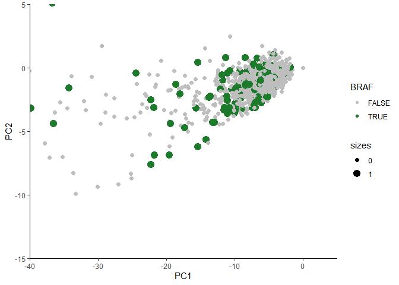

# 1.Preparation 
## 1.1 Enviroment setup

```r
remotes::install_github("vqv/ggbiplot")
requiredPackages = c('here','ggplot2','devtools','ggbiplot')
for(p in requiredPackages){
  if(!require(p,character.only = TRUE)) install.packages(p)
  library(p,character.only = TRUE)
}

requiredPackages2=c('PCAtools','airway','magrittr','DESeq2')
for (k in requiredPackages2){
  if (!requireNamespace(k)) BiocManager::install(k)
  library(k,character.only = TRUE)
  }
```

## 1.2 Load data,genotype embedding, response


```r
compoundname=read.csv2(here::here("data","compound_names.txt"),header=TRUE,sep="\t")
drugcell_all=read.csv2(here::here("data","drugcell_all.txt"),header=FALSE,sep="\t")
cellname=read.csv2(here::here("data","cell2ind.txt"),header=FALSE,sep="\t")
cellmutation=read.csv2(here::here("data","cell2mutation.txt"),header=FALSE,sep=",")
genename=read.csv2(here::here("data","gene2ind.txt"),header=FALSE,sep="\t")
```

## 1.3 PCA preparation

```r
PCA_cell_TT=prcomp(cellmutation,scale. = TRUE, center=TRUE)
PCA_cell_FT=prcomp(cellmutation,scale. = FALSE, center=TRUE)
PCA_cell_TF=prcomp(cellmutation,scale. = TRUE, center=FALSE)
PCA_cell_FF=prcomp(cellmutation,scale. = FALSE, center=FALSE)

write.table(file=here::here("data","PCA","cell2mutation.csv"),cellmutation,row.names = F,col.names = T,sep=",")
write.table(file=here::here("data","PCA","cell2mutation2.csv"),data.frame(cellmutation,cellmutation[,288]),row.names = F,col.names = T,sep=",")
```

# 2 plot PCA
## 2.0 Try CACNA1B,having n=229, at row 329, scale=T, center=T

```r
# CACNA1B is row 329
genename[grepl("CACNA1B",genename[,2])==TRUE,]
```

```
##      V1      V2
## 329 328 CACNA1B
```

```r
table(data.frame(cellmutation[,329]))
```

```
## cellmutation...329.
##   0   1 
## 996 229
```

```r
PCA_cell_CACNA1B=data.frame(PCA_cell_TT$x,as.logical(cellmutation[,329]),factor(cellmutation[,329]))

colnames(PCA_cell_CACNA1B)[c(1226,1227)]=c("CACNA1B","sizes")

PCA_cell_CACNA1B1=PCA_cell_CACNA1B[which(PCA_cell_CACNA1B[,1226]==TRUE),]
PCA_cell_CACNA1B2=PCA_cell_CACNA1B[which(PCA_cell_CACNA1B[,1226]==FALSE),]

# combined

colors <- c("true" = "grey", "false" = "#1c7a2b")


ggplot(NULL,aes(x=PC1,y=PC2))+
  geom_point(data=data.frame(PCA_cell_CACNA1B2),aes(color="true"), size = 2)+
  geom_point(data=data.frame(PCA_cell_CACNA1B1),aes(color="false"), size = 3)+
  xlab("PC1")+ ylab("PC2")+ ggtitle("CACNA1B, scale=T, center=T")+
  coord_cartesian(expand = FALSE, #turn off axis expansion (padding)
                  xlim = c(-10, 20),ylim=c(-4,4)
                  )+
  theme_bw()+
  theme(panel.border=element_blank(),panel.grid.major=element_blank(),panel.grid.minor=element_blank(),axis.line= element_line(color = "black"))+
  scale_color_manual(values = colors)
```

<!-- -->

```r
ggsave("PCA_cell_CACNA1B.png",path=here::here("data","PCA"), width = 4.5, height = 5)

# save CACNA1B SET
write.table(file=here::here("data","PCA","PCA_cell_CACNA1B.txt"),PCA_cell_CACNA1B[,1:1226] ,col.names = T,sep ="\t")
```


## 2.1 BRAF mutations with , scale=T, center=T

```r
PCA_cell_BRAF_TT=data.frame(PCA_cell_TT$x,as.logical(cellmutation[,288]),factor(cellmutation[,288]))

colnames(PCA_cell_BRAF_TT)[c(1226,1227)]=c("BRAF","sizes")

plot(PCA_cell_TT$x[,1], PCA_cell_TT$x[,2],)
```

<!-- -->

```r
# plot(PCA_cell_TT$x[,1], PCA_cell_TT$x[,2])

PCA_cell_scaled_names=c("PC1","PC2")

# ggplot(data=data.frame(PCA_cell_scaled_scaled$x),aes(x=PCA_cell_scaled_scaled_names[1],y=PCA_cell_scaled_scaled_names[2]))+


PCA_cell_BRAF_TT1=PCA_cell_BRAF_TT[which(PCA_cell_BRAF_TT[,1226]==TRUE),]
PCA_cell_BRAF_TT2=PCA_cell_BRAF_TT[which(PCA_cell_BRAF_TT[,1226]==FALSE),]

# combined

colors <- c("true" = "grey", "false" = "#1c7a2b")


ggplot(NULL,aes(x=PC1,y=PC2))+
  geom_point(data=data.frame(PCA_cell_BRAF_TT2),aes(color="true"), size = 2)+
  geom_point(data=data.frame(PCA_cell_BRAF_TT1),aes(color="false"), size = 3)+
  xlab("PC1")+ ylab("PC2")+ ggtitle("BRAF, scale=T, center=T")+
  coord_cartesian(expand = FALSE, #turn off axis expansion (padding)
                  xlim = c(-10, 20),ylim=c(-4,4)
                  )+
  theme_bw()+
  theme(panel.border=element_blank(),panel.grid.major=element_blank(),panel.grid.minor=element_blank(),axis.line= element_line(color = "black"))+
  scale_color_manual(values = colors)
```

<!-- -->

```r
ggsave("PCA_cell_BRAF_TT.png",path=here::here("data","PCA"), width = 4.5, height = 5)
```


## 2.2 BRAF mutations with , scale=T, center=F


```r
PCA_cell_BRAF_TF=data.frame(PCA_cell_TF$x,as.logical(cellmutation[,288]),factor(cellmutation[,288]))

colnames(PCA_cell_BRAF_TF)[c(1226,1227)]=c("BRAF","sizes")

# plot(PCA_cell_TF$x[,1], PCA_cell_TF$x[,2])

# View(head(PCA_cell_TF$x,3))
PCA_cell_TF_names=c("PC1","PC2")

# ggplot(data=data.frame(PCA_cell_TF_scaled$x),aes(x=PCA_cell_TF_scaled_names[1],y=PCA_cell_TF_scaled_names[2]))+

ggplot(data=data.frame(PCA_cell_BRAF_TF),
       aes_string(x=colnames(PCA_cell_BRAF_TF)[1],y=colnames(PCA_cell_BRAF_TF)[2],
                  color=colnames(PCA_cell_BRAF_TF)[1226],
                  group=colnames(PCA_cell_BRAF_TF)[1226],
                  size=colnames(PCA_cell_BRAF_TF)[1227]
                  ))+
  geom_point(shape=19)+
  scale_size_manual(values=c(2,4))+
  scale_color_manual(values = c("grey", "#1c7a2b"))+
  xlab("PC1")+ ylab("PC2")+ ggtitle("BRAF, scale=T, center=F")+
  coord_cartesian(expand = FALSE, #turn off axis expansion (padding)
                  # xlim = c(-2.5, 2.5),ylim=c(-1,1)
                 xlim = c(-30, 0),ylim=c(-5,3)

                  )+
  theme_bw()+
  theme(panel.border=element_blank(),panel.grid.major=element_blank(),panel.grid.minor=element_blank(),axis.line= element_line(colour = "black"))
```

<!-- -->

```r
ggsave("PCA_cell_BRAF_TF.png",path=here::here("data","PCA"), width = 4.5, height = 5)
```


## 2.3 BRAF mutations, scale=F, center=T, n=175 doesn't match with figure 3A's n=229

```r
# BRAF is row 288
genename[grepl("BRAF",genename[,2])==TRUE,]
```

```
##      V1   V2
## 288 287 BRAF
```

```r
# but it only has 175 mutated cell lines, not 229
table(data.frame(cellmutation[,288]))
```

```
## cellmutation...288.
##    0    1 
## 1050  175
```

```r
# PCA_cell_BRAF=data.frame(PCA_cell$x,BRAF=cellmutation[,288])
PCA_cell_BRAF_FT=data.frame(PCA_cell_FT$x,as.logical(cellmutation[,288]),factor(cellmutation[,288]))

colnames(PCA_cell_BRAF_FT)[c(1226,1227)]=c("BRAF","sizes")

# simply plot
plot(PCA_cell_FT$x[,1], PCA_cell_FT$x[,2])
```

<!-- -->

```r
# View(head(PCA_cell_FT$x,3))


# ggplot(data=data.frame(PCA_cell_scaled$x),aes(x=PCA_cell_scaled_names[1],y=PCA_cell_scaled_names[2]))+

ggplot(data=data.frame(PCA_cell_BRAF_FT),
       aes_string(x=colnames(PCA_cell_BRAF_FT)[1],y=colnames(PCA_cell_BRAF_FT)[2],
                  color=colnames(PCA_cell_BRAF_FT)[1226],
                  group=colnames(PCA_cell_BRAF_FT)[1226],
                  size=colnames(PCA_cell_BRAF_FT)[1227]
                  ))+
  geom_point(shape=19)+
  scale_size_manual(values=c(2,4))+
  scale_color_manual(values = c("grey", "#1c7a2b"))+
  xlab("PC1")+ ylab("PC2")+ ggtitle("BRAF, scale=F, center=T")+
  coord_cartesian(expand = FALSE, #turn off axis expansion (padding)
                  # xlim = c(-2.5, 2.5),ylim=c(-1,1)
                  xlim = c(-2.5, 2.5),ylim=c(-1,1)
                  )+
  theme_bw()+
  theme(panel.border=element_blank(),panel.grid.major=element_blank(),panel.grid.minor=element_blank(),axis.line= element_line(colour = "black"))
```

<!-- -->

```r
ggsave("PCA_cell_BRAF_FT.png",path=here::here("data","PCA"), width = 4.5, height = 5)


# save BRAF SET
write.table(file=here::here("data","PCA","PCA_cell_BRAF_FT.txt"),PCA_cell_BRAF_FT[,1:1226] ,col.names = T,sep ="\t")
```


## 2.4 BRAF mutations, scale=F, center=F


```r
PCA_cell_BRAF_FF=data.frame(PCA_cell_FF$x,as.logical(cellmutation[,288]),factor(cellmutation[,288]))

colnames(PCA_cell_BRAF_FF)[c(1226,1227)]=c("BRAF","sizes")

# plot(PCA_cell_FF$x[,1], PCA_cell_FF$x[,2])

# View(head(PCA_cell_FF$x,3))
PCA_cell_FF_names=c("PC1","PC2")

# ggplot(data=data.frame(PCA_cell_FF_scaled$x),aes(x=PCA_cell_FF_scaled_names[1],y=PCA_cell_FF_scaled_names[2]))+

ggplot(data=data.frame(PCA_cell_BRAF_FF),
       aes_string(x=colnames(PCA_cell_BRAF_FF)[1],y=colnames(PCA_cell_BRAF_FF)[2],
                  color=colnames(PCA_cell_BRAF_FF)[1226],
                  group=colnames(PCA_cell_BRAF_FF)[1226],
                  size=colnames(PCA_cell_BRAF_FF)[1227]
                  ))+
  geom_point(shape=19)+
  scale_size_manual(values=c(2,4))+
  scale_color_manual(values = c("grey", "#1c7a2b"))+
  xlab("PC1")+ ylab("PC2")+ ggtitle("BRAF, scale=F, center=F")+
  coord_cartesian(expand = FALSE, #turn off axis expansion (padding)
                  xlim = c(-5, 0),ylim=c(-0.5,3)
                  # xlim = c(-10, 0),ylim=c(-5,10)
                  )+
  theme_bw()+
  theme(panel.border=element_blank(),panel.grid.major=element_blank(),panel.grid.minor=element_blank(),axis.line= element_line(colour = "black"))
```

<!-- -->

```r
ggsave("PCA_cell_BRAF_FF.png",path=here::here("data","PCA"), width = 4.5, height = 5)
```

## make a scree plot

```r
PCA_cell.var <- PCA_cell_TT$sdev^2
PCA_cell.var.per <- round(PCA_cell.var/sum(PCA_cell.var)*100, 2)

barplot(PCA_cell.var.per, main="Scree Plot", xlab="Principal Component", ylab="Percent Variation")
```

<!-- -->

```r
PCA_cell.var.per2=data.frame(index=c(1:length(PCA_cell.var.per)),variation=PCA_cell.var.per)

ggplot(data=PCA_cell.var.per2, aes(x=index,y=variation))+
  xlab("Principal Component")+ ylab("Percent Variation")+
  geom_bar(stat="identity")+
  coord_cartesian(expand = FALSE, #turn off axis expansion (padding)
                  xlim = c(0, 20),ylim=c(0,15))+
  theme_bw()+
  theme(panel.border=element_blank(),panel.grid.major=element_blank(),panel.grid.minor=element_blank(),axis.line= element_line(colour = "black"))
```

<!-- -->

```r
# sum(PCA_cell.var.per)
```

## biplot

```r
ggbiplot(PCA_cell,labels =NULL)
```

```
## Error in ggbiplot(PCA_cell, labels = NULL): object 'PCA_cell' not found
```

```r
ggbiplot(PCA_cell_scaled)
```

```
## Error in ggbiplot(PCA_cell_scaled): object 'PCA_cell_scaled' not found
```

```r
ggbiplot(PCA_cell_scaled_nocentered)
```

```
## Error in ggbiplot(PCA_cell_scaled_nocentered): object 'PCA_cell_scaled_nocentered' not found
```

```r
biplot(PCA_cell)
```

```
## Error in biplot(PCA_cell): object 'PCA_cell' not found
```

```r
biplot(PCA_cell_scaled)
```

```
## Error in biplot(PCA_cell_scaled): object 'PCA_cell_scaled' not found
```

```r
biplot(PCA_cell_scaled_nocentered)
```

```
## Error in biplot(PCA_cell_scaled_nocentered): object 'PCA_cell_scaled_nocentered' not found
```

## PCAtools


```r
library(airway)
library(magrittr)

data('airway')
airway$dex %<>% relevel('untrt')
```

### Annotate the Ensembl gene IDs to gene symbols:

```r
  ens <- rownames(airway)

  library(org.Hs.eg.db)
```

```
## Error in library(org.Hs.eg.db): there is no package called 'org.Hs.eg.db'
```

```r
  symbols <- mapIds(org.Hs.eg.db, keys = ens,
    column = c('SYMBOL'), keytype = 'ENSEMBL')
```

```
## Error in mapIds(org.Hs.eg.db, keys = ens, column = c("SYMBOL"), keytype = "ENSEMBL"): could not find function "mapIds"
```

```r
  symbols <- symbols[!is.na(symbols)]
```

```
## Warning in is.na(symbols): is.na() applied to non-(list or vector) of type
## 'closure'
```

```
## Error in symbols[!is.na(symbols)]: object of type 'closure' is not subsettable
```

```r
  symbols <- symbols[match(rownames(airway), names(symbols))]
```

```
## Error in symbols[match(rownames(airway), names(symbols))]: object of type 'closure' is not subsettable
```

```r
  rownames(airway) <- symbols
```

```
## Error in as.character(names): cannot coerce type 'closure' to vector of type 'character'
```

```r
  keep <- !is.na(rownames(airway))
  airway <- airway[keep,]
```


### Normalise the data and transform the normalised counts to variance-stabilised expression levels:

```r
  library('DESeq2')
  dds <- DESeqDataSet(airway, design = ~ cell + dex)
  dds <- DESeq(dds)
```

```
## estimating size factors
```

```
## estimating dispersions
```

```
## gene-wise dispersion estimates
```

```
## mean-dispersion relationship
```

```
## final dispersion estimates
```

```
## fitting model and testing
```

```r
  vst <- assay(vst(dds))
```

# Conduct principal component analysis (PCA):


```r
p <- pca(vst, metadata = colData(airway), removeVar = 0.1)
```

```
## -- removing the lower 10% of variables based on variance
```

```r
## -- removing the lower 10% of variables based on variance


## scree plot
screeplot(p, axisLabSize = 18, titleLabSize = 22)
```

```
## Warning: Removed 2 row(s) containing missing values (geom_path).
```

```
## Warning: Removed 2 rows containing missing values (geom_point).
```

<!-- -->
## 3.3 A bi-plot


```r
biplot(p)
```

<!-- -->

```r
biplot(p, showLoadings = TRUE,
  labSize = 5, pointSize = 5, sizeLoadingsNames = 5)
```

<!-- -->

```r
pcatool_PCA=pca(cellmutation)

biplot(pcatool_PCA, showLoadings = TRUE,
  labSize = 0, pointSize = 2, sizeLoadingsNames = 0)
```

```
## Warning: Removed 6 rows containing missing values (geom_segment).
```

```
## Warning: Removed 6 rows containing missing values (geom_label_repel).
```

<!-- -->

```r
ggbiplot(pcatool_PCA)
```

```
## Error in ggbiplot(pcatool_PCA): Expected a object of class prcomp, princomp, PCA, or lda
```

```r
ggplot(data=data.frame(PCA_cell_BRAF_TF),
     aes_string(x=colnames(PCA_cell_BRAF_TF)[1],y=colnames(PCA_cell_BRAF_TF)[2],
                color=colnames(PCA_cell_BRAF_TF)[1226],
                group=colnames(PCA_cell_BRAF_TF)[1226],
                size=colnames(PCA_cell_BRAF_TF)[1227]
                ))+
geom_point(shape=19)+
scale_size_manual(values=c(2,4))+
scale_color_manual(values = c("grey", "#1c7a2b"))+
xlab("PC1")+ ylab("PC2")+
coord_cartesian(expand = FALSE, #turn off axis expansion (padding)
                # xlim = c(-2.5, 2.5),ylim=c(-1,1)
                xlim = c(-40, 5),ylim=c(-15,5)
                )+
theme_bw()+
theme(panel.border=element_blank(),panel.grid.major=element_blank(),panel.grid.minor=element_blank(),axis.line= element_line(colour = "black"))
```

<!-- -->
