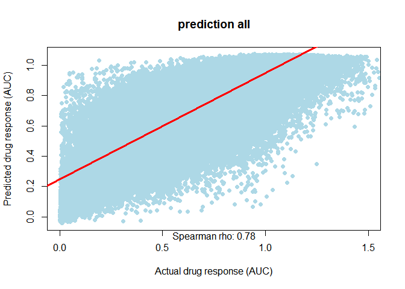

## draw spearman for prediction 1/5


```r
# https://r-coder.com/correlation-plot-r/
<<<<<<< HEAD
=======
# Data generation
>>>>>>> 6428af18e699f2936be9ba004d2d6c0e5c142955
set.seed(1)
index="1"
x=read.csv2(paste0("E:/google\ drive/Thesis/data/drugcell_related/data/sample/split52/drugcell_test",index,".txt"),header=FALSE,sep="\t")
x=as.numeric(x[[3]])
y=as.numeric(read.csv2(paste0("E:/google\ drive/Thesis/data/drugcell_related/data/predict/predict",index,"/Result_sample/drugcell.predict"),header=FALSE,sep="\t")[[1]])
<<<<<<< HEAD

=======
# names(x) <- NULL
# names(y) <- NULL
# x <- 1:100
# y <- x + rnorm(100, mean = 0, sd = 15)
>>>>>>> 6428af18e699f2936be9ba004d2d6c0e5c142955
# Creating the plot
# plot(x[1:100], y[1:100], pch = 19, col = "lightblue",xlim=c(0,1.5))
plot(x, y, pch = 19, col = "lightblue",xlim=c(0,1.5),
     xlab="Actual drug response (AUC)",ylab="Predicted drug response (AUC)",
     main=paste0("prediction ",index,"/5"),sub="")

# Regression line
abline(lm(y ~ x), col = "red", lwd = 3)
# text(paste("Correlation:", text1), x=85, y=25)
text1=round(cor(x, y, method = "spearman"),2)
mtext(paste("Spearman rho:", text1), side=1)
```

<!-- -->

```r
# Pearson correlation


# https://rpubs.com/aaronsc32/spearman-rank-correlation
# cor.test(x, y, method = 'spearman')
```
## draw spearman for prediction 2/5


```r
<<<<<<< HEAD
=======
# https://r-coder.com/correlation-plot-r/
# Data generation
set.seed(1)
>>>>>>> 6428af18e699f2936be9ba004d2d6c0e5c142955
index="2"
x=read.csv2(paste0("E:/google\ drive/Thesis/data/drugcell_related/data/sample/split52/drugcell_test",index,".txt"),header=FALSE,sep="\t")
x=as.numeric(x[[3]])
y=as.numeric(read.csv2(paste0("E:/google\ drive/Thesis/data/drugcell_related/data/predict/predict",index,"/Result_sample/drugcell.predict"),header=FALSE,sep="\t")[[1]])
<<<<<<< HEAD

=======
# names(x) <- NULL
# names(y) <- NULL
# x <- 1:100
# y <- x + rnorm(100, mean = 0, sd = 15)
# Creating the plot
# plot(x[1:100], y[1:100], pch = 19, col = "lightblue",xlim=c(0,1.5))
>>>>>>> 6428af18e699f2936be9ba004d2d6c0e5c142955
plot(x, y, pch = 19, col = "lightblue",xlim=c(0,1.5),
     xlab="Actual drug response (AUC)",ylab="Predicted drug response (AUC)",
     main=paste0("prediction ",index,"/5"),sub="")

# Regression line
abline(lm(y ~ x), col = "red", lwd = 3)
# text(paste("Correlation:", text1), x=85, y=25)
text1=round(cor(x, y, method = "spearman"),2)
mtext(paste("Spearman rho:", text1), side=1)
```

<!-- -->
<<<<<<< HEAD
=======

```r
# Pearson correlation


# https://rpubs.com/aaronsc32/spearman-rank-correlation
# cor.test(x, y, method = 'spearman')
```
>>>>>>> 6428af18e699f2936be9ba004d2d6c0e5c142955
## draw spearman for prediction 3/5


```r
<<<<<<< HEAD
=======
# https://r-coder.com/correlation-plot-r/
# Data generation
set.seed(1)
>>>>>>> 6428af18e699f2936be9ba004d2d6c0e5c142955
index="3"
x=read.csv2(paste0("E:/google\ drive/Thesis/data/drugcell_related/data/sample/split52/drugcell_test",index,".txt"),header=FALSE,sep="\t")
x=as.numeric(x[[3]])
y=as.numeric(read.csv2(paste0("E:/google\ drive/Thesis/data/drugcell_related/data/predict/predict",index,"/Result_sample/drugcell.predict"),header=FALSE,sep="\t")[[1]])
<<<<<<< HEAD
=======
# names(x) <- NULL
# names(y) <- NULL
# x <- 1:100
# y <- x + rnorm(100, mean = 0, sd = 15)
# Creating the plot
# plot(x[1:100], y[1:100], pch = 19, col = "lightblue",xlim=c(0,1.5))
>>>>>>> 6428af18e699f2936be9ba004d2d6c0e5c142955
plot(x, y, pch = 19, col = "lightblue",xlim=c(0,1.5),
     xlab="Actual drug response (AUC)",ylab="Predicted drug response (AUC)",
     main=paste0("prediction ",index,"/5"),sub="")

# Regression line
abline(lm(y ~ x), col = "red", lwd = 3)
<<<<<<< HEAD
=======
# text(paste("Correlation:", text1), x=85, y=25)
>>>>>>> 6428af18e699f2936be9ba004d2d6c0e5c142955
text1=round(cor(x, y, method = "spearman"),2)
mtext(paste("Spearman rho:", text1), side=1)
```

<!-- -->
<<<<<<< HEAD
=======

```r
# Pearson correlation


# https://rpubs.com/aaronsc32/spearman-rank-correlation
# cor.test(x, y, method = 'spearman')
```
>>>>>>> 6428af18e699f2936be9ba004d2d6c0e5c142955
## draw spearman for prediction 4/5


```r
<<<<<<< HEAD
=======
# https://r-coder.com/correlation-plot-r/
# Data generation
set.seed(1)
>>>>>>> 6428af18e699f2936be9ba004d2d6c0e5c142955
index="4"
x=read.csv2(paste0("E:/google\ drive/Thesis/data/drugcell_related/data/sample/split52/drugcell_test",index,".txt"),header=FALSE,sep="\t")
x=as.numeric(x[[3]])
y=as.numeric(read.csv2(paste0("E:/google\ drive/Thesis/data/drugcell_related/data/predict/predict",index,"/Result_sample/drugcell.predict"),header=FALSE,sep="\t")[[1]])
<<<<<<< HEAD

=======
# names(x) <- NULL
# names(y) <- NULL
# x <- 1:100
# y <- x + rnorm(100, mean = 0, sd = 15)
# Creating the plot
# plot(x[1:100], y[1:100], pch = 19, col = "lightblue",xlim=c(0,1.5))
>>>>>>> 6428af18e699f2936be9ba004d2d6c0e5c142955
plot(x, y, pch = 19, col = "lightblue",xlim=c(0,1.5),
     xlab="Actual drug response (AUC)",ylab="Predicted drug response (AUC)",
     main=paste0("prediction ",index,"/5"),sub="")

# Regression line
abline(lm(y ~ x), col = "red", lwd = 3)
<<<<<<< HEAD
=======
# text(paste("Correlation:", text1), x=85, y=25)
>>>>>>> 6428af18e699f2936be9ba004d2d6c0e5c142955
text1=round(cor(x, y, method = "spearman"),2)
mtext(paste("Spearman rho:", text1), side=1)
```

<!-- -->
<<<<<<< HEAD
=======

```r
# Pearson correlation


# https://rpubs.com/aaronsc32/spearman-rank-correlation
# cor.test(x, y, method = 'spearman')
```
>>>>>>> 6428af18e699f2936be9ba004d2d6c0e5c142955
## draw spearman for prediction 5/5


```r
<<<<<<< HEAD
=======
# https://r-coder.com/correlation-plot-r/
# Data generation
set.seed(1)
>>>>>>> 6428af18e699f2936be9ba004d2d6c0e5c142955
index="5"
x=read.csv2(paste0("E:/google\ drive/Thesis/data/drugcell_related/data/sample/split52/drugcell_test",index,".txt"),header=FALSE,sep="\t")
x=as.numeric(x[[3]])
y=as.numeric(read.csv2(paste0("E:/google\ drive/Thesis/data/drugcell_related/data/predict/predict",index,"/Result_sample/drugcell.predict"),header=FALSE,sep="\t")[[1]])
<<<<<<< HEAD

=======
# names(x) <- NULL
# names(y) <- NULL
# x <- 1:100
# y <- x + rnorm(100, mean = 0, sd = 15)
# Creating the plot
# plot(x[1:100], y[1:100], pch = 19, col = "lightblue",xlim=c(0,1.5))
>>>>>>> 6428af18e699f2936be9ba004d2d6c0e5c142955
plot(x, y, pch = 19, col = "lightblue",xlim=c(0,1.5),
     xlab="Actual drug response (AUC)",ylab="Predicted drug response (AUC)",
     main=paste0("prediction ",index,"/5"),sub="")

# Regression line
abline(lm(y ~ x), col = "red", lwd = 3)
<<<<<<< HEAD
=======
# text(paste("Correlation:", text1), x=85, y=25)
>>>>>>> 6428af18e699f2936be9ba004d2d6c0e5c142955
text1=round(cor(x, y, method = "spearman"),2)
mtext(paste("Spearman rho:", text1), side=1)
```

<!-- -->

<<<<<<< HEAD
=======
```r
# Pearson correlation


# https://rpubs.com/aaronsc32/spearman-rank-correlation
# cor.test(x, y, method = 'spearman')
```

>>>>>>> 6428af18e699f2936be9ba004d2d6c0e5c142955

## draw spearman for prediction 550_5


```r
<<<<<<< HEAD
=======
# https://r-coder.com/correlation-plot-r/
# Data generation
set.seed(1)
>>>>>>> 6428af18e699f2936be9ba004d2d6c0e5c142955
index="5"
index2="5"
x=read.csv2(paste0("E:/google\ drive/Thesis/data/drugcell_related/data/sample/split52/drugcell_test",index,".txt"),header=FALSE,sep="\t")
x=as.numeric(x[[3]])
y=as.numeric(read.csv2(paste0("E:/google\ drive/Thesis/data/drugcell_related/data/predict/predict",index2,"/Result_sample/drugcell.predict"),header=FALSE,sep="\t")[[1]])
<<<<<<< HEAD

=======
# names(x) <- NULL
# names(y) <- NULL
# x <- 1:100
# y <- x + rnorm(100, mean = 0, sd = 15)
# Creating the plot
# plot(x[1:100], y[1:100], pch = 19, col = "lightblue",xlim=c(0,1.5))
>>>>>>> 6428af18e699f2936be9ba004d2d6c0e5c142955
plot(x, y, pch = 19, col = "lightblue",xlim=c(0,1.5),
     xlab="Actual drug response (AUC)",ylab="Predicted drug response (AUC)",
     main=paste0("prediction ",index2),sub="")

# Regression line
abline(lm(y ~ x), col = "red", lwd = 3)
<<<<<<< HEAD

=======
# text(paste("Correlation:", text1), x=85, y=25)
>>>>>>> 6428af18e699f2936be9ba004d2d6c0e5c142955
text1=round(cor(x, y, method = "spearman"),2)
mtext(paste("Spearman rho:", text1), side=1)
```

<!-- -->

<<<<<<< HEAD
=======
```r
# Pearson correlation


# https://rpubs.com/aaronsc32/spearman-rank-correlation
# cor.test(x, y, method = 'spearman')
```

>>>>>>> 6428af18e699f2936be9ba004d2d6c0e5c142955
## draw spearman for prediction all


```r
<<<<<<< HEAD
=======
# https://r-coder.com/correlation-plot-r/
# Data generation
set.seed(1)
>>>>>>> 6428af18e699f2936be9ba004d2d6c0e5c142955
index="all"
x=read.csv2(paste0("E:/google\ drive/Thesis/data/drugcell_related/data/sample/drugcell_all.txt"),header=FALSE,sep="\t")
x=as.numeric(x[[3]])
y=as.numeric(read.csv2(paste0("E:/google\ drive/Thesis/data/drugcell_related/data/predict/predict",index,"/Result_sample/drugcell.predict"),header=FALSE,sep="\t")[[1]])
<<<<<<< HEAD

=======
# names(x) <- NULL
# names(y) <- NULL
# x <- 1:100
# y <- x + rnorm(100, mean = 0, sd = 15)
# Creating the plot
# plot(x[1:100], y[1:100], pch = 19, col = "lightblue",xlim=c(0,1.5))
>>>>>>> 6428af18e699f2936be9ba004d2d6c0e5c142955
plot(x, y, pch = 19, col = "lightblue",xlim=c(0,1.5),
     xlab="Actual drug response (AUC)",ylab="Predicted drug response (AUC)",
     main=paste0("prediction ",index),sub="")

# Regression line
abline(lm(y ~ x), col = "red", lwd = 3)
<<<<<<< HEAD
=======
# text(paste("Correlation:", text1), x=85, y=25)
>>>>>>> 6428af18e699f2936be9ba004d2d6c0e5c142955
text1=round(cor(x, y, method = "spearman"),2)
mtext(paste("Spearman rho:", text1), side=1)
```

<!-- -->

<<<<<<< HEAD
=======
```r
# Pearson correlation


# https://rpubs.com/aaronsc32/spearman-rank-correlation
# cor.test(x, y, method = 'spearman')
```

>>>>>>> 6428af18e699f2936be9ba004d2d6c0e5c142955
